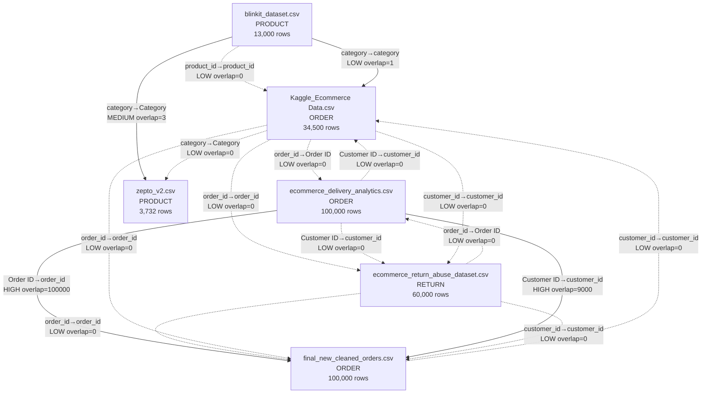

# Dataset relationship candidates (Phase 1)

Joins are proposed only after **name alignment** plus **set overlap** of identifier values.
Zero-overlap same-named IDs are listed as LOW confidence (namespace collision, not a join).

## Diagram

## Relationship table

| Parent | Parent col | Child | Child col | Parent nunique | Child nunique | Intersection | Child coverage % | Jaccard | Confidence | Note |
|---|---|---|---|---:|---:|---:|---:|---:|---|---|
| `blinkit_dataset.csv` | `product_id` | `Kaggle_Ecommerce Data.csv` | `product_id` | 13000 | 24912 | 0 | 0.0 | 0.0 | **LOW** | shared normalized column name `product_id` |
| `blinkit_dataset.csv` | `category` | `Kaggle_Ecommerce Data.csv` | `category` | 8 | 7 | 1 | 14.2857 | 0.071429 | **LOW** | shared normalized column name `category` |
| `blinkit_dataset.csv` | `category` | `zepto_v2.csv` | `Category` | 8 | 14 | 3 | 21.4286 | 0.157895 | **MEDIUM** | shared normalized column name `category` |
| `Kaggle_Ecommerce Data.csv` | `category` | `zepto_v2.csv` | `Category` | 7 | 14 | 0 | 0.0 | 0.0 | **LOW** | shared normalized column name `category` |
| `ecommerce_return_abuse_dataset.csv` | `order_id` | `ecommerce_delivery_analytics.csv` | `Order ID` | 60000 | 100000 | 0 | 0.0 | 0.0 | **LOW** | shared normalized column name `order_id` |
| `ecommerce_delivery_analytics.csv` | `Order ID` | `final_new_cleaned_orders.csv` | `order_id` | 100000 | 100000 | 100000 | 100.0 | 1.0 | **HIGH** | shared normalized column name `order_id` |
| `Kaggle_Ecommerce Data.csv` | `order_id` | `ecommerce_delivery_analytics.csv` | `Order ID` | 34500 | 100000 | 0 | 0.0 | 0.0 | **LOW** | shared normalized column name `order_id` |
| `ecommerce_return_abuse_dataset.csv` | `order_id` | `final_new_cleaned_orders.csv` | `order_id` | 60000 | 100000 | 0 | 0.0 | 0.0 | **LOW** | shared normalized column name `order_id` |
| `Kaggle_Ecommerce Data.csv` | `order_id` | `ecommerce_return_abuse_dataset.csv` | `order_id` | 34500 | 60000 | 0 | 0.0 | 0.0 | **LOW** | shared normalized column name `order_id` |
| `Kaggle_Ecommerce Data.csv` | `order_id` | `final_new_cleaned_orders.csv` | `order_id` | 34500 | 100000 | 0 | 0.0 | 0.0 | **LOW** | shared normalized column name `order_id` |
| `ecommerce_delivery_analytics.csv` | `Customer ID` | `ecommerce_return_abuse_dataset.csv` | `customer_id` | 9000 | 58006 | 0 | 0.0 | 0.0 | **LOW** | shared normalized column name `customer_id` |
| `ecommerce_delivery_analytics.csv` | `Customer ID` | `final_new_cleaned_orders.csv` | `customer_id` | 9000 | 9000 | 9000 | 100.0 | 1.0 | **HIGH** | shared normalized column name `customer_id` |
| `ecommerce_delivery_analytics.csv` | `Customer ID` | `Kaggle_Ecommerce Data.csv` | `customer_id` | 9000 | 7903 | 0 | 0.0 | 0.0 | **LOW** | shared normalized column name `customer_id` |
| `ecommerce_return_abuse_dataset.csv` | `customer_id` | `final_new_cleaned_orders.csv` | `customer_id` | 58006 | 9000 | 0 | 0.0 | 0.0 | **LOW** | shared normalized column name `customer_id` |
| `Kaggle_Ecommerce Data.csv` | `customer_id` | `ecommerce_return_abuse_dataset.csv` | `customer_id` | 7903 | 58006 | 0 | 0.0 | 0.0 | **LOW** | shared normalized column name `customer_id` |
| `final_new_cleaned_orders.csv` | `customer_id` | `Kaggle_Ecommerce Data.csv` | `customer_id` | 9000 | 7903 | 0 | 0.0 | 0.0 | **LOW** | shared normalized column name `customer_id` |

## Interpretation rules used

- HIGH: same logical name and ≥80% coverage of one side.
- MEDIUM: same name and ≥20% coverage, or ≥50 intersecting IDs with a name match.
- LOW: name match with little/no value overlap (do **not** join).
